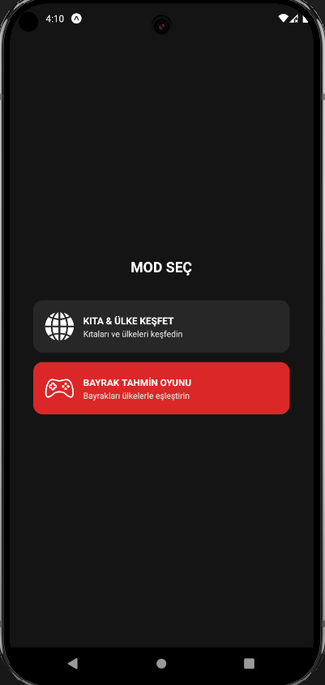

# FlagPedia - Kıta & Ülke Bilgileri ve Bayrak Tahmin Oyunu

**FlagPedi**, dünya üzerindeki kıta ve ülkeleri keşfetmeyi sağlayan, aynı zamanda bayrakları ülkelere eşleştirerek coğrafi bilginizi test edebileceğiniz mobil bir uygulamadır. Uygulama, **React Native + Expo** altyapısı kullanılarak platform bağımsız şekilde geliştirilmiştir.

## 📱 Özellikler

### 🌍 Kıta & Ülke Keşfet Modu
- Kıtalar ve ülkeler listelenebilir.
- Her ülke hakkında detaylı bilgilere erişim sağlanır.
- Ülke bilgileri internetten dinamik olarak çekilir.

### 🎮 Bayrak Tahmin Oyunu
- Kullanıcılara bayraklar gösterilir ve doğru ülkeyi bulmaları beklenir.
- Kartlar sağa veya sola kaydırılarak tahmin yapılır.
- Doğru ve yanlış yanıtlar için sesli geri bildirim mevcuttur.
- Skor sistemi ile performans takip edilir.

### 🔊 Sesli Etkileşim
- Doğru ve yanlış cevaplar için sesli bilgilendirme sistemi entegre edilmiştir.
- Gelişmiş kullanıcı deneyimi hedeflenmiştir.

### 🛰️ Dinamik Veri Entegrasyonu
- Bayrak görselleri ve ülke bilgileri online kaynaklardan çekilmektedir.
- Uygulama düşük boyutlu ve güncel veri yapısıyla optimize edilmiştir.

## 💡 Kullanılan Teknolojiler

- **React Native** (Expo Managed Workflow)
- **JavaScript / TypeScript**
- **React Navigation** (yönlendirme altyapısı)
- **Axios / Fetch API** (veri alma)
- **Expo AV** (ses oynatma)
- **Context API / AsyncStorage** (durum ve skor yönetimi)

## 🚀 Yayın Durumu

Uygulama şu anda **Google Play** üzerinden yayında: [Google Play](https://play.google.com/store/apps/details?id=dev.expo.flagpedia&hl=tr)

## 📸 Ekran Görüntüsü

